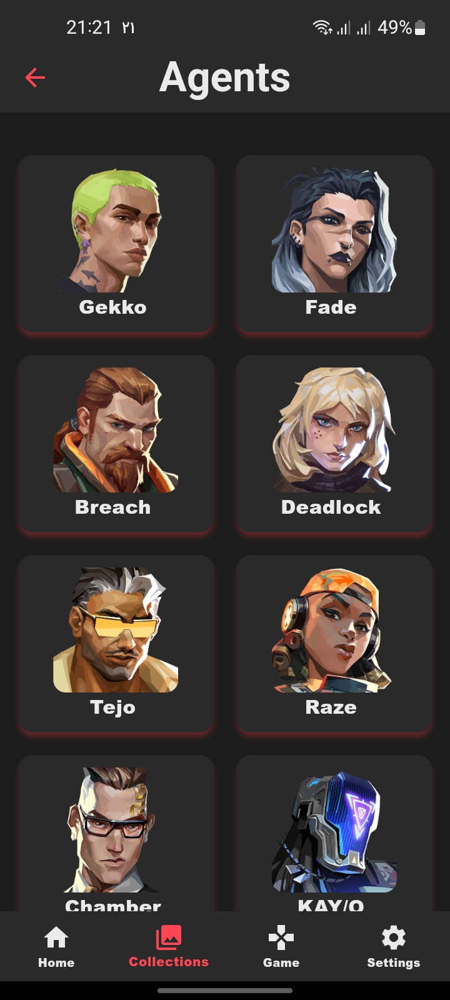
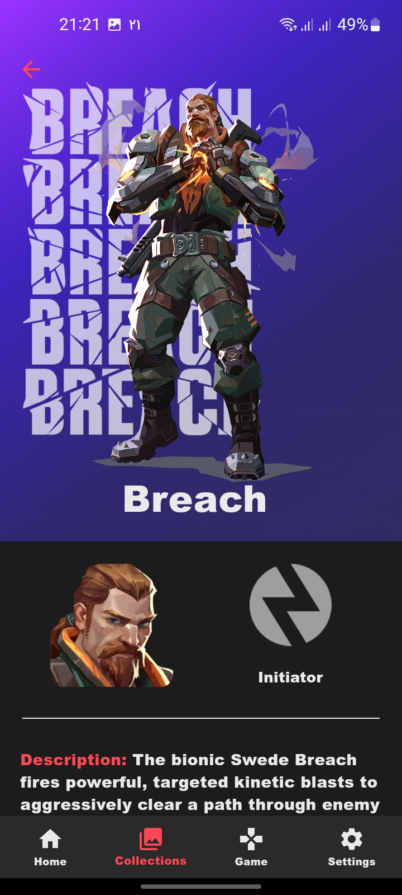
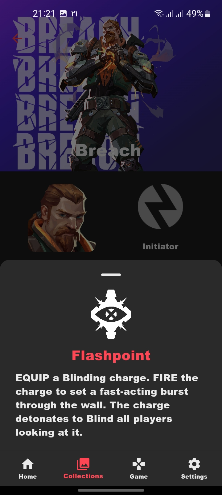
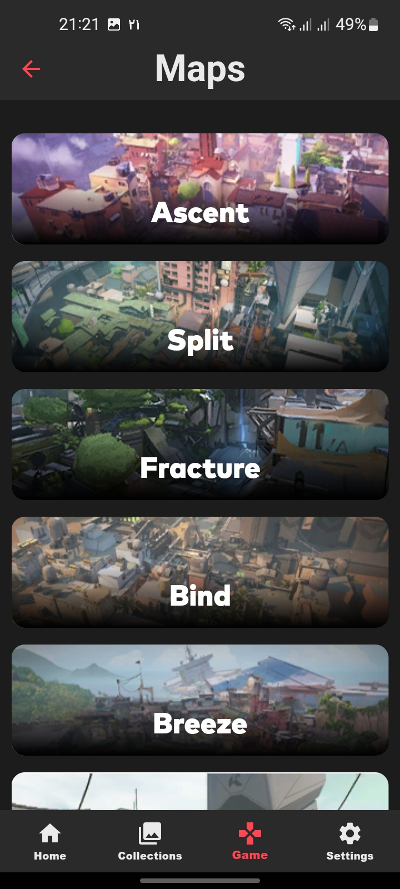
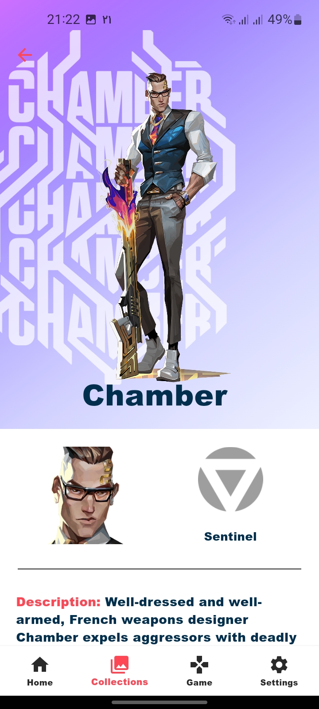

# Valorant Intel
A visually rich Flutter app that brings all Valorant in-game assets—agents, guns, maps, and more—right to your fingertips, powered by the Valorant API.

---

## 🚀 Features
- Browse all Valorant agents with detailed stats and abilities
- Explore weapon skins, stats, and categories
- View interactive maps with callouts
- Fast, beautiful, and responsive UI
- Powered by the latest Valorant API data

## 🖼️ Screenshots

<table>
  <tr>
    <th style="width: 220px; text-align: center;">Agents Screen</th>
    <th style="width: 220px; text-align: center;">Agent Details(1)</th>
    <th style="width: 220px; text-align: center;">Agent Details(2)</th>
    <th style="width: 220px; text-align: center;">Maps Screen</th>
    <th style="width: 220px; text-align: center;">Light Mode</th>
  </tr>
  <tr>
    <td >
      
    </td>
    <td >
      
    </td>
    <td >
      
    </td>
    <td >
      
    </td>
    <td >
      
    </td>
  </tr>
</table>

## 🛠️ Usage
- Launch the app and navigate through Agents, Weapons, and Maps tabs.
- Tap on any asset for detailed information and visuals.

## 📚 Credits
- [Valorant API](https://valorant-api.com/)
- [Flutter](https://flutter.dev/)
- Inspired by the Valorant community
<!-- 
## 📄 License
This project is licensed under the MIT License. -->
